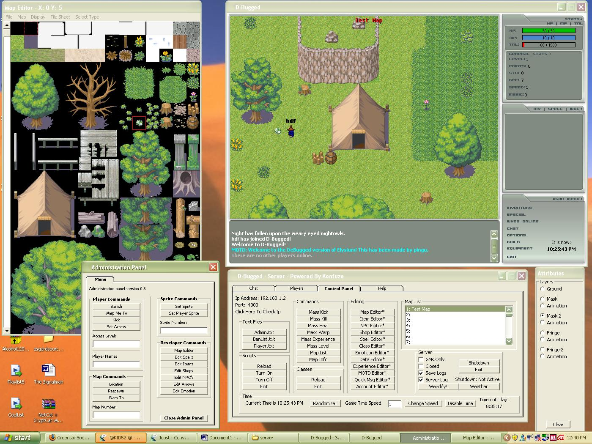



## Elysium Source \(2d MMORPG\)

### Description

This code lets you make an entire ORPG (limited by the max of Winsock, which can be replaced by Sox, to increase online user capacity) or even an ORPG engine. It has all the features a decent MMORPG needs, guilds, melee, magic and ranged combat, basic AI, easy to use map-editor, etcetera.
 
### More Info
 
If you get any Runtime-errors, browse to our forum @ splamm.com/elysium. And/or register the .dll's the program needs.

             |
---                |---
**Submitted On**   |2005-09-21 22:28:08
**By**             |[Joost](https://github.com/Planet-Source-Code/PSCIndex/blob/master/ByAuthor/joost.md)
**Level**          |Intermediate
**User Rating**    |4.2 (25 globes from 6 users)
**Compatibility**  |VB 6\.0
**Category**       |[Games](https://github.com/Planet-Source-Code/PSCIndex/blob/master/ByCategory/games__1-38.md)
**World**          |[Visual Basic](https://github.com/Planet-Source-Code/PSCIndex/blob/master/ByWorld/visual-basic.md)
**Archive File**   |[Elysium\_So1975342222006\.zip](https://github.com/Planet-Source-Code/joost-elysium-source-2d-mmorpg__1-64412/archive/master.zip)

